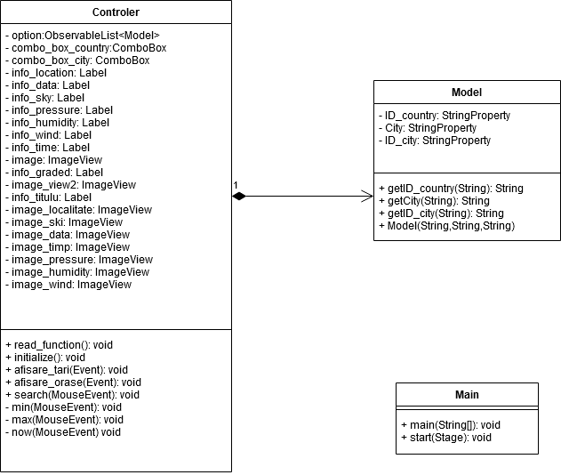
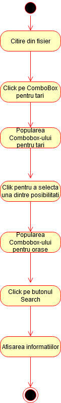

# EmiMeteo
 

# Continut

 - [Prezentare](#prezentare)
 - [Utilizare](#utilizare)
 - [Proiectant](#proiectant)
 - [Diagrama de clase](#diagramaclase)
 - [Diagrama de activitati](#diagramaactiv)	

## Prezentare
Proiectul prezentat contine o aplicatie Java. Aceasta aplicatie este una informativa, datele furnizate fiind date meteorologice exacte. Fisierul de input contine informatii despre diferite localitati din toata lumea urmand ca aplicatia sa foloseasca aceste date pentru a face request-uri catre API-ul [OpenWeatherMap]("https://openweathermap.org/api").

## Utilizare
Fisierul de input care contine informatiile despre localitati se afla in fisierul **_src/main/resources/input_**.
Datele prezente in fisierul de input sunt:

 - ID
 - Numele localitatii
 - Latitudine
 - Longitudine
 - Codul tarii

**_Exemplu fisier de input:_**

819827	Razvilka	55.5917	37.7408	RU 
524901	Moscow		55.7522	37.6156	RU 
2973393	Tarascon	43.8058	4.6603	FR 
2986678	Ploufragan	48.4914	-2.7946	FR 
666767	Slatina		44.433	24.367	RO 
 
  In urma rularii aplicatiei, pentru a obtine rezultatele dorite se vor respecta urmatorii pasi:
  
 - Selectarea unei tari
 - Selectarea unui oras
 - Click pe butonul de search

Alte functionalitati:

 - Buton de afisare a temperaturii **_MINIME_**.
 - Buton de afisare a temperaturii **_MAXIME_**
 - Buton de afisare a temperaturii **_NORMALE_**

## Diagrama de clase

## Diagrama de activitati

 

## Proiectant
:man_student:Dumitru Emilian-Nicusor

